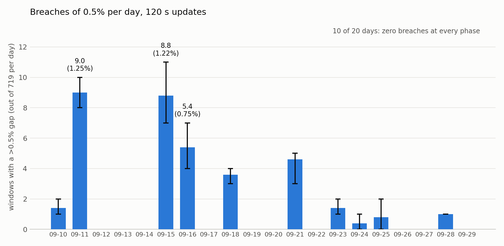
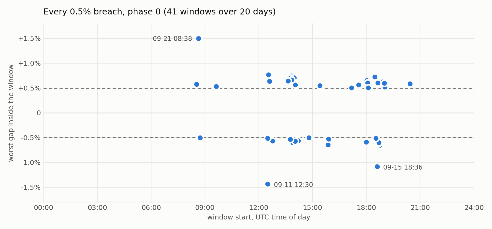

# LON 2-minute push cadence vs. a 0.5% deviation threshold

LON publishes a price at most once per round, about every 2 minutes. Other oracle
networks could update much faster, but to save gas they publish only once the
price has moved by a fixed deviation threshold, here 0.5%. Under this assumption,
the LON-specific error is how often a 2-minute schedule leaves the published price
more than 0.5% away from the market. This report measures it on real Binance data.

**Result: over 20 days of BTCUSDT, 99.75% of 2-minute windows stay within the 0.5%
threshold at every instant. The other 0.25% (roughly 1 in 400) contain a moment
where the market is more than 0.5% away from the last published price; at the
update instant itself it is 0.09%. The breaches arrive in a few short bursts of
fast price moves, and the worst gap was 1.5%.**

## Method

- Data: Binance spot BTCUSDT 1-second klines, 2026-09-10 to 2026-09-29 (20 UTC
  days, 14,380 windows per phase).
- Model: the oracle publishes the close of the first second of each 120 s window
  and holds it until the next window. Windows do not overlap.
- Two measures per window, relative to the published price:
  - **endpoint**: deviation at the moment of the next update.
  - **intra-window**: largest deviation at any second inside the window (using
    each second's high and low). This is the exposure that matters, because a gap
    can be exploited as soon as it opens.
- Threshold 0.5%. Phases 0, 5, 10, 15, 20 s (offset of the update schedule).
- Assumption: the 2-minute cycle is end to end, covering fetching, consensus and
  writing to LEZ, so the published price equals the market price at the start of
  the cycle. If the real observation-to-LEZ delay is D, read the results as a
  cadence of 120 s + D.

## Results

| phase | windows | endpoint breaches | intra-window breaches | worst intra-window |
|------:|--------:|------------------:|----------------------:|-------------------:|
| 0 s   | 14,380  | 16 (0.111%)       | 41 (0.285%)           | 1.497%             |
| 5 s   | 14,380  | 12 (0.083%)       | 38 (0.264%)           | 1.435%             |
| 10 s  | 14,380  | 13 (0.090%)       | 34 (0.236%)           | 1.415%             |
| 15 s  | 14,380  | 13 (0.090%)       | 35 (0.243%)           | 1.381%             |
| 20 s  | 14,380  | 14 (0.097%)       | 34 (0.236%)           | 1.276%             |
| **mean** | 14,380 | **13.6 (0.094%)** | **36.4 (0.253%)**   |                    |



*Figure 1. Number of 2-minute windows per day (out of 719) in which the market
moved more than 0.5% away from the published price at some instant. Bar: mean
over the five phase offsets (0, 5, 10, 15, 20 s); whisker: minimum to maximum
across the phases. Example: on Sep 11 the five phases gave 8, 9, 10, 9 and 9
breaching windows, so the bar is 9.0, which is 1.25% of that day's 719 windows.
Days without a bar had zero breaches at every phase.*



*Figure 2. Each dot is one breaching window at phase 0 (41 in total). Horizontal
position: window start time in UTC. Vertical position: the largest gap to the
published price inside the window (positive: market above the published price,
negative: below). Dashed lines mark the +/-0.5% threshold.*

## Findings

1. **Rare on average, about 1 window in 400.** On average that is under 2 windows
   per day (0.25% of 720), but they do not arrive evenly.
2. **Breaches come in bursts.** Half of the days (10 of 20) had no breach at any
   phase. The rest concentrate in 18 bursts, the longest lasting about an hour.
   At phase 0, five days hold 34 of the 41 breaches (Sep 11, 15, 16, 18, 21). The
   bursts cluster around 12:30, 13:45-14:00, 15:50 and 18:00-19:00 UTC, which are
   the usual US macro-release and Fed-decision hours (not checked against the
   calendar).
3. **Daily range is a weak predictor; sharp moves are the cause.** Sep 14 moved
   4.2% high to low with zero breaches, while Sep 16 moved 2.0% and had 4-7.
   A breach needs a fast move inside two minutes, not a wide day.
4. **The tail is about 1.3-1.5%.** The three largest gaps are +1.497% (Sep 21
   08:38), -1.435% (Sep 11 12:30) and -1.086% (Sep 15 18:36). The worst window is
   1.28-1.50% across phases, so the tail does not depend on the alignment.
5. **Intra-window counts are about 2.7 times the endpoint counts.** Judging the
   oracle only at the update instant would miss most of the exposure.
6. **The headline rate is stable across phases.** 34 to 41 intra-window breaches
   (0.24-0.29%) over five alignments.

## Caveats

- **The 2-minute cycle is assumed to be end to end** (see Method). Any extra
  delay between observation and the value being usable on LEZ makes the real gap
  larger than measured here.
- **The five alignments cover only the first 20 s of the 120 s cycle.** Shifts of
  20-115 s were not run. A wider sweep is cheap
  (`./run.sh --phases 0,10,20,...,110`) and was not done here.
- A breach means a gap opened, not that it persisted or was profitable; fees,
  slippage and pool depth cut into any real arbitrage.
- Threshold-triggered oracles are not immune: price can move past the threshold
  during their own transaction latency.
- One venue (Binance spot), one month, 1-second OHLC granularity. A median over
  several sources would dampen single-venue noise, so these figures lean toward an
  upper bound.

## Reproduce

```bash
./fetch-data.sh --days 20 --end 2026-09-29
for p in 0 5 10 15 20; do ./run.sh --window 120 --threshold 0.5 --phase $p; done
```
This downloaded the last 20 days prices in `data` folder. Then,

```bash
./run.sh --window 120 --threshold 0.5 --phase 0
./run.sh --window 120 --threshold 0.5 --phase 5
./run.sh --window 120 --threshold 0.5 --phase 10
./run.sh --window 120 --threshold 0.5 --phase 15
```
These scripts count that within 120 seconds intervals, if there are changes more than %0.5 with different phases,
phases delay the start of the update schedule by seconds, so the first
window starts at 00:00:N instead of 00:00:00 and the following ones at
00:02:N, 00:04:N, and so on. The real oracle's update clock is not aligned to
anything in the market, so the exact second at which windows start is arbitrary.
Running several phases checks that the result does not depend on that choice: if
the breach count barely moves between phases (here 34 to 41 intra-window
breaches), the result is robust. If it moved a lot, the single count would
depend on where the window boundaries happened to fall.
